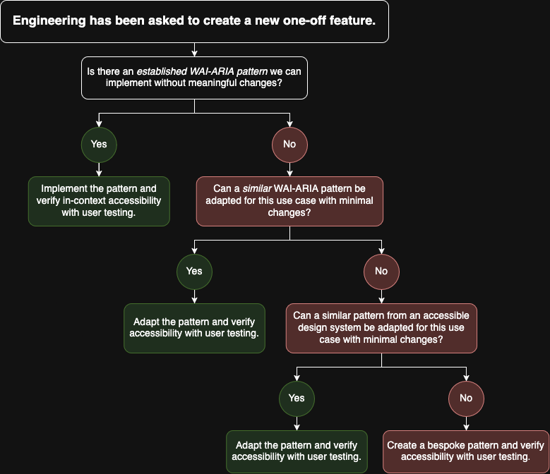

For a talk I'm giving next month I wanted to create a decision tree
accessibility advocates can use to determine the ideal touchpoints for when to
user test while developing a new off-system feature or pattern. Lately I've been
thinking quite a bit about how to promote integrating user testing tools and
resources into developers and designers daily work flows and so while to the trained
eye this might seem _a bit silly_ (since it recommends user testing at each
step), I think it helps illustrate the general framework developers and
designers should be operating in when creating bespoke components or placing
them inside larger patterns.
  

The top node presents the situation and says "engineering has been asked to create a new one-off feature". The branch below it asks the question: "Is there an established WAI-ARIA pattern we can implement without meaningful changes?". It leads down to 'yes' and 'no' branches. If yes the chart states, "implement the pattern and verify in-context accessibility with user testing". The 'no' branch presents a follow up question, "can a similar WAI-ARIA pattern be adapted for this user case with minimal changes?". Below is a 'yes' or 'no' branch. Under the 'yes' branch is the statement, "adapt the pattern and verify accessibility with user testing". Under the 'no' branch it asks the question, "can a similar pattern from an accessible design system be adapted for this use case with minimal changes?". Below this question is one final 'yes' or 'no' branch. Under the 'yes' branch it states, "adapt the pattern and verify accessibility with user testing". Under the 'no' branch it instructs the user to, "create a bespoke pattern and verify accessibility with user testing".

